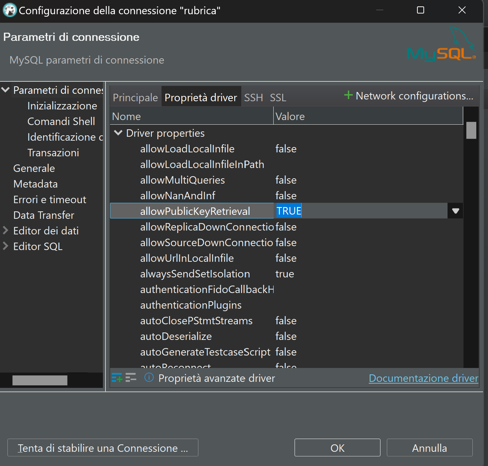
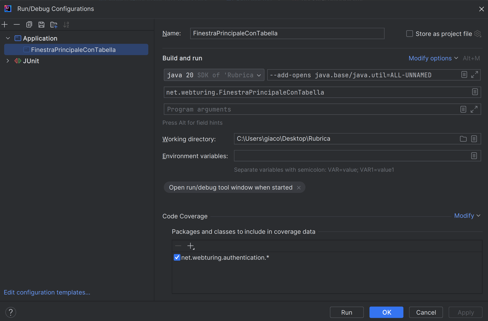

# Rubrica
L'applicazione per il momento è stata testata solo su Windows 11 Pro.

Per avviare il progetto far partire Docker Desktop (assicurandosi che sia aggiornato) se si opera da Windows oppure equivalentemente da Linux/Ubuntu
`sudo systemctl start docker`

Eseguire successivamente `docker-compose up -d`

Verificare che il database MySQL (utenza radice **root** con password **root**) sia pronto: devono essere stati creati correttamente lo schema **rubrica** e le tabelle **persona** e **utente**.

Se si usa DBeaver per la connessione al database, scaricare i driver di MySQL e impostare la proprietà allowPublicKeyRetrieval a true.

<!-- 

-->

Assicurarsi di aver settato il driver per la connessione al database da **Project Structure**

Ho preso il driver di MySQL 9.3.0 dal sito open source, scegliendo la tipologia **Platform Independent**
https://dev.mysql.com/downloads/connector/j/

A questo punto eseguire il main *FinestraPrincipaleConTabella*.

<!--  -->

L'applicazione si presenta nel seguente modo:

<!--  -->

Le credenziali di accesso sono: username **admin** e password **1234** (come si evince dallo script di inizializzazione del database **init/schema_database.sql**):
`INSERT INTO utenti (username, password) VALUES ('admin', '1234');`

In caso di credenziali non fornite o errate e click sul bottone **LOGIN**, si avrà un messaggio di errore:

<!--  -->

Una volta effettuato il login con le credenziali corrette viene presentata la finestra principale con una tabella vuota (valorizzata se ci sono dati nel database rubrica.persona)

Cliccando su nuovo viene presentata la finestra di creazione

Al momento solo il campo età è un numero intero obbligatorio, gli altri possono essere vuoti. Sul database viene staccato un bigint progressivo per ogni nuovo utente creato (unicità sulla chiave primaria id).
Il pulsante modifica presenta la stessa schermata precedente, con i campi valorizzati della persona la cui riga è stata selezionata.

Quando si elimina un utente viene chiesta una conferma:

Se non si seleziona la riga prima di eliminare una persona viene presentato un messaggio all'utente:

Lo stesso vale in caso di modifica.

Ho preferito usare Docker e i container per la creazione del database per realizzare velocemente qualcosa di funzionante, senza preoccuparmi della configurazione. Se avrò tempo aggiungerò un utente diverso dall'utente root, con privilegi ridotti.

C'è una batteria di test automatici *FinestraPrincipaleTest* che funziona con persistenza su file, devo sistemare alcune cose per i test automatici con persistenza su DB.
Per eseguire i test usare un IDE come IntelliJ e fare **edit configuration**>**modify options** e aggiungere
`--add-opens java.base/java.util=ALL-UNNAMED`

